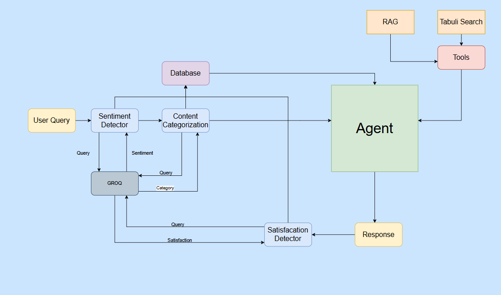
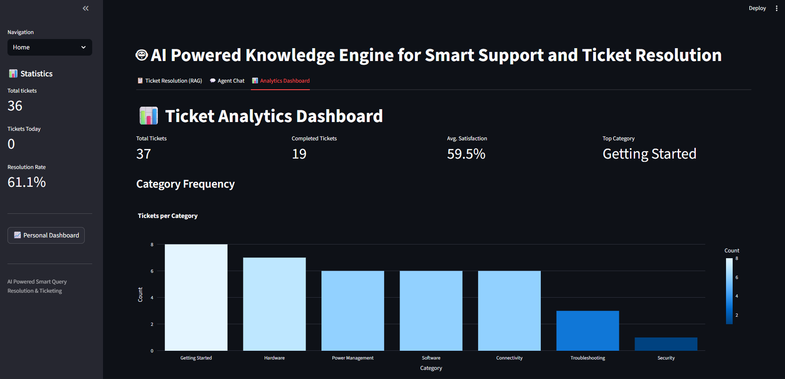

# 🤖 AI-Powered Knowledge Engine for Smart Support and Ticket Resolution

### 🏫 Developed under Infosys Springboard Internship 6.0

This project leverages **Natural Language Processing (NLP)**, **Machine Learning**, **Knowledge Graphs**, and a **Slack-based notification system for low coverage areas** to build an intelligent, reliable, and context-aware support engine.

---

## 🚀 Overview

The **AI-Powered Knowledge Engine** automates customer support and ticket management by:

- Classifying and prioritizing support tickets.
- Suggesting context-based resolutions.
- Automating ticket workflows using machine learning.
- Handling notifications in low connectivity regions through a **Slack-based messaging system**.

---

## 🧩 Key Features

- 🧠 **AI Question Answering** – Understands user queries and provides contextual answers.
- 📊 **Ticket Classification & Validation** – Categorizes tickets and evaluates model performance.
- 📈 **Interactive Dashboard** – Displays metrics like Accuracy, Precision, Recall, and F1-score.
- 🔄 **Google Sheets Integration** – Dynamically reads and updates records using Google Sheets API.
- 💬 **Slack Notification System** – Sends alerts to a Slack channel for low coverage or critical updates.

---

## 🛠️ Tech Stack

| Component            | Technology                             |
| -------------------- | -------------------------------------- |
| Frontend / UI        | Streamlit                              |
| Backend              | Python 3.10+                           |
| Data Handling        | Pandas                                 |
| Async Execution      | AsyncIO, Nest-AsyncIO                  |
| External Integration | Google Sheets API                      |
| Notifications        | Slack messaging for low coverage areas |

---

## 🔁 How It Works

1. User or agent submits a support ticket via integrated form or sheet.
2. Data is read dynamically from Google Sheets.
3. The AI model processes the ticket, classifies its category, and searches related articles.
4. Results are displayed on Streamlit Dashboard.
5. Slack notifications are triggered for low coverage or missing knowledge areas.

---

## ⚙️ Setup and Installation Guide

Follow these steps to set up and run the project locally:

---

### 1️⃣ Clone the Repository

```bash
git clone https://github.com/BalajiSunkara-123/AI-Powered-Knowledge-Engine-for-Smart-Support-and-Ticket-Resolution.git
cd AI-Powered-Knowledge-Engine-for-Smart-Support-and-Ticket-Resolution
```

### Create a Virtual Environment

```bash
# For Windows
python -m venv env
env\Scripts\activate

# For macOS/Linux
python3 -m venv env
source env/bin/activate
```

### 3️⃣ Install Required Packages

```bash
pip install -r requirements.txt
```

### 4️⃣ Setup Google Sheets API Credentials

Follow these steps to configure Google Sheets API access:

1. **Go to Google Cloud Console**  
   [https://console.cloud.google.com/](https://console.cloud.google.com/)

2. **Create or select a project**.

3. **Enable APIs**:

   - Google Sheets API
   - Google Drive API

4. **Create a Service Account**:

   - Go to **IAM & Admin → Service Accounts**
   - Click **Create Service Account**
   - Assign a name and description
   - Click **Create and Continue**

5. **Generate JSON Key**:

   - Click **Add Key → Create New Key → JSON**
   - Download the key file

6. **Rename the downloaded key**:

```text
credentials.json
```

7. **_Place it in the project root directory._**
8. **_Add credentials.json to .gitignore_**

### 5️⃣ Create .env File

Add environment variables in .env at the project root:

```bash
GOOGLE_SHEETS_CREDENTIALS="credentials.json"
SPREADSHEET_ID="your_google_sheet_id_here"
SLACK_WEBHOOK_URL="your_slack_webhook_url_here"
```

### 6️⃣ Run the Streamlit App

```bash
streamlit run app.py
```

Open your browser at: http://localhost:8501

---

### Project Architecture / Workflow Diagram

## 

## 🖼️ Sample Output



---

## 🌱 Future Improvements

- Fine-tune chatbot for deeper contextual understanding.
- Add multilingual support.
- Integrate sentiment analysis for ticket prioritization.
- Extend dashboard analytics for trend prediction.

## 🤝 Contributing

Pull requests are welcome. For major changes, please open an issue first to discuss what you’d like to change.

## 📜 License

This project is licensed under the MIT License - see the [LICENSE](LICENSE) file for details.
